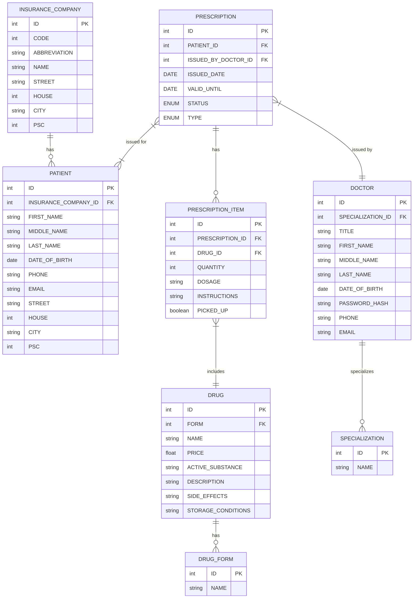

# Database

Here is an entity-relationship diagram of the database used in the Healthcare E-Prescription App.

```mermaid
erDiagram
    DRUG ||--o{ DRUG_FORM: has
    DRUG {
        int ID PK
        int FORM FK
        string NAME
        float PRICE
        string ACTIVE_SUBSTANCE
        string DESCRIPTION
        string SIDE_EFFECTS
        string STORAGE_CONDITIONS
    }
    DRUG_FORM {
        int ID PK
        string NAME
    }

    INSURANCE_COMPANY ||--o{ PATIENT: has
    INSURANCE_COMPANY {
        int ID PK
        int CODE
        string ABBREVIATION
        string NAME
        string STREET
        int HOUSE
        string CITY
        int PSC
    }
    PATIENT {
        int ID PK
        int INSURANCE_COMPANY_ID FK
        string FIRST_NAME
        string MIDDLE_NAME
        string LAST_NAME
        date DATE_OF_BIRTH
        string PHONE
        string EMAIL
        string STREET
        int HOUSE
        string CITY
        int PSC
    }

    DOCTOR ||--o{ SPECIALIZATION: specializes
    DOCTOR {
        int ID PK
        int SPECIALIZATION_ID FK
        string TITLE
        string FIRST_NAME
        string MIDDLE_NAME
        string LAST_NAME
        date DATE_OF_BIRTH
        string PASSWORD_HASH
        string PHONE
        string EMAIL
    }
    SPECIALIZATION {
        int ID PK
        string NAME
    }

    PRESCRIPTION ||--o{ PRESCRIPTION_ITEM: has
    PRESCRIPTION {
        int ID PK
        int PATIENT_ID FK
        int ISSUED_BY_DOCTOR_ID FK
        DATE ISSUED_DATE
        DATE VALID_UNTIL
        ENUM STATUS
        ENUM TYPE
    }
    PRESCRIPTION_ITEM {
        int ID PK
        int PRESCRIPTION_ID FK
        int DRUG_ID FK
        int QUANTITY
        string DOSAGE
        string INSTRUCTIONS
        boolean PICKED_UP
    }

    PRESCRIPTION_ITEM }|--|| DRUG: "includes"
    PRESCRIPTION }|--|{ PATIENT: "issued for"
    PRESCRIPTION }|--|| DOCTOR: "issued by"

```